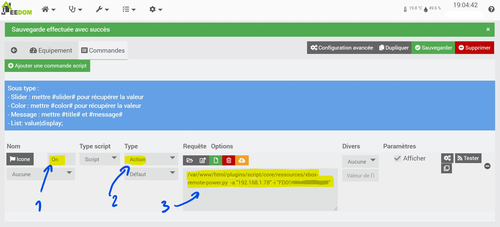
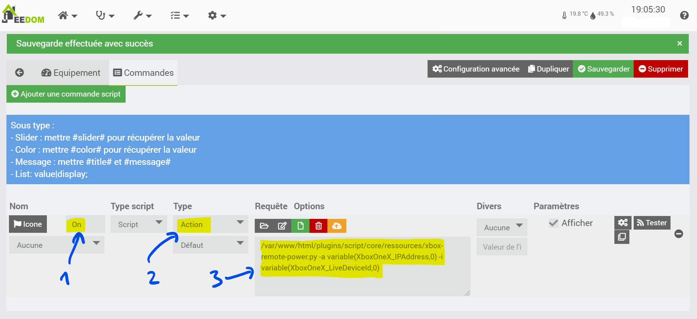

# Xbox Remote Power

This is a little script that can turn your Xbox One on remotely.

## Prerequisite

You need three things for this to work:

- Python 2 or 3 installed
- IP address of your Xbox One
- Live device ID of your Xbox One

To find the IP of your Xbox, go to Settings -> Network -> Advanced settings.

To find your Live device ID, go to Settings -> System -> Console info.

## How to use

Run the script as follows, replacing [ip address] with the IP of your Xbox One and [live id] with your Live device ID.

```bash
python xbox-remote-power.py -a [ip address] -i [live id]
```

From the Script plugin interface you can use it like this by creating an "Xbox On" command :


and if you use variables :

